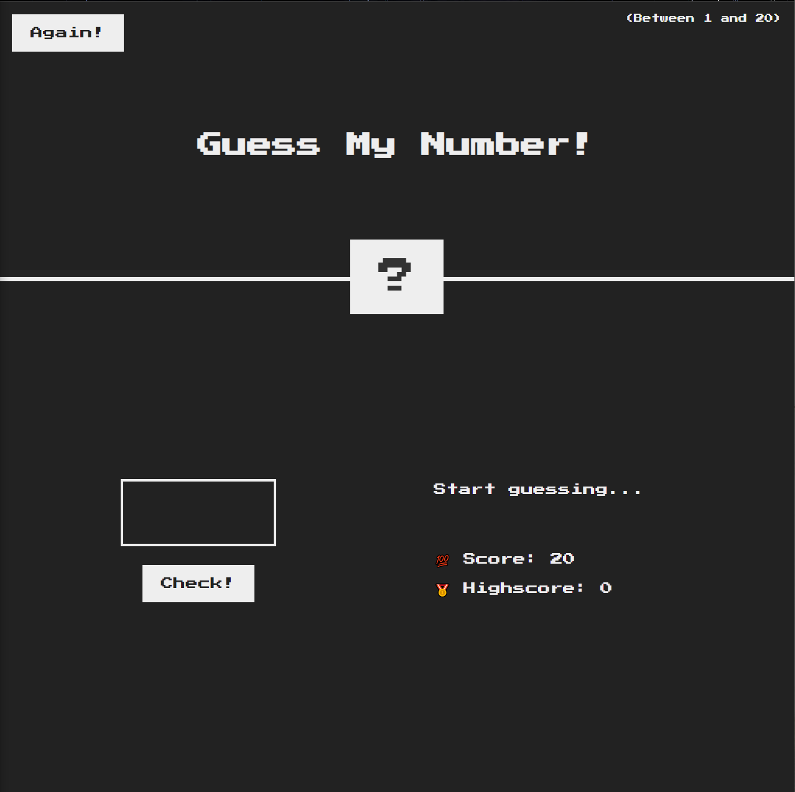

# Guess My Number

## Description

Guess my number is a fun game made using HTML, CSS, and JavaScript where a number from 0-20 is randomly generated and the goal is to guess what the number is. The less attempts it takes to do so, the higher the score will be.
This game was made to enforce the Fundamentals of JavaScript as well as an introduction to interacting with the DOM. I only worked on the JavaScript side of this game, the rest was provided by [Jonas Schmedtmann](https://www.udemy.com/course/the-complete-javascript-course/#instructor-1).
During the development of the game I was able to learn how we can interact with the DOM in may ways such as; adding funtionality to a button, changing the CSS style when a certain condition is met, restarting everything with a restart button.
It also introduced me into the "Math()" object and helped me in my journey of thinking like a developer.

## Usage

To play the game you can [Click Here!](https://renfunny.github.io/guess-my-number/). Just insert your guess in the box on the bottom left and click the "Check!" button right below it or press Enter on your keyboard.
Here's a screenshot of the game 

## Credits

A big thanks to [Jonas Schmedtmann](https://www.udemy.com/course/the-complete-javascript-course/#instructor-1) for preparing this game and challenging us to think like a developer!
